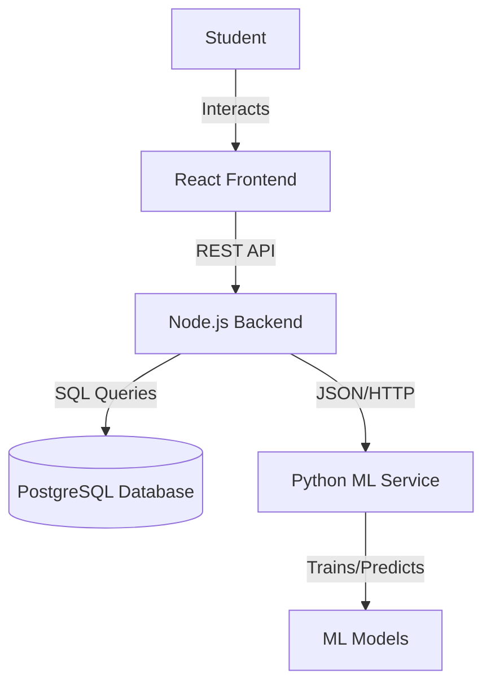

# Study-Sync: Comprehensive Project Guide

## 1. Project Overview
**Study-Sync** is an intelligent, adaptive planner designed to solve the "planning fallacy"—the tendency for students to underestimate how long tasks will take. Unlike standard to-do apps, Study-Sync uses **Machine Learning** to predict the *actual* time a task needs and automatically schedules it into the student's free time blocks, respecting their sleep and daily routines.

## 2. High-Level Architecture
The project follows a **Microservices-based Architecture** with three distinct layers communicating over HTTP and JSON.



---

## 3. Component Details

### A. Frontend (The User Interface)
*   **Location:** `/frontend`
*   **Tech Stack:** React 19, Vite, TailwindCSS.
*   **Key Features:**
    *   **Dashboard:** Displays "Up Next" tasks, progress bars, and gamification stats (XP, Streaks).
    *   **Task Input Form:** Collects detailed metadata (Subject, Complexity, Page Counts) to feed the ML model.
    *   **Schedule View:** A timeline visualization showing when tasks are scheduled.
*   **Interaction:** Sends user inputs to the Node.js backend; never communicates directly with the Python service or DB.

### B. Backend (The Orchestrator)
*   **Location:** `/backend`
*   **Tech Stack:** Node.js, Express.js.
*   **Role:** Acts as the API Gateway and Controller.
*   **Key Responsibilities:**
    *   **Data Management:** Handles CRUD operations for `Tasks`, `Users`, and `TaskHistory`.
    *   **ML Integration:** When a task is created, the backend calls the ML Service (`ml_client.js`) to get a time prediction *before* saving the task to the database.
    *   **Triggers:** Automatically triggers model retraining when a task is marked "Completed" to keep the AI personalized.

### C. ML Service (The Brain)
*   **Location:** `/ml_service`
*   **Tech Stack:** Python 3.9, FastAPI, Scikit-learn, Pandas.
*   **Core Logic:**
    1.  **Hybrid Prediction Model:**
        *   *Global Layer:* Uses **Histogram-Based Gradient Boosting** trained on 2,000+ realistic student tasks to understand general patterns (e.g., "Math takes longer than Reading").
        *   *Personal Layer:* Uses **Linear Regression** trained on the specific user's history (once they complete >5 tasks) to learn their personal speed.
    2.  **Smart Scheduler (`schedule.py`):**
        *   Calculates "Free Slots" by subtracting the user's **Routine** (Classes, Sleep, Meals) from the 24-hour day.
        *   Uses a heuristics-based "Bin Packing" algorithm to fit tasks into these slots.
        *   Splits large tasks into smaller "Pomodoro-style" sessions (e.g., a 90-minute essay becomes two 45-minute blocks).

### D. Database (The Memory)
*   **Location:** PostgreSQL Instance.
*   **Schema:**
    *   `users`: Stores profile, XP, and JSON-based daily routine configuration.
    *   `tasks`: Active tasks with both `estimated_size` (user guess) and `ml_predicted_time` (AI guess).
    *   `task_history`: Completed tasks used as the training dataset for personalization.

---

## 4. detailed 'Life of a Task' Workflow

### Phase 1: Creation & Prediction
1.  **User Input:** Student enters "History Essay" (High Complexity, 5 Pages).
2.  **API Call:** Frontend sends data to `POST /api/tasks`.
3.  **ML Inference:** Backend sends features to Python Service.
4.  **AI Calculation:**
    *   Python converts "High" -> 3, "History" -> Humanities.
    *   Base Model predicts 75 mins.
    *   *If User Model exists:* User is 1.2x slower -> adjusts to 90 mins.
5.  **Storage:** Task is saved in DB with `ml_predicted_time = 90`.

### Phase 2: Scheduling
1.  **Request:** User views "Schedule" page.
2.  **Processing:**
    *   Python script `schedule.py` loads the user's `Routine` (e.g., Wake 7AM, Sleep 11PM, School 9-3).
    *   It identifies a free gap: 4:00 PM - 6:00 PM.
    *   It places the 90-minute "History Essay" there.
3.  **Display:** User sees "History Essay" scheduled for 4:00 PM.

### Phase 3: Execution & Learning
1.  **Action:** User marks task as "Done". Actual time taken: 100 mins.
2.  **Record:** Backend moves task to `task_history` with `actual_time = 100`.
3.  **Feedback Loop:**
    *   Backend checks history count.
    *   It calls `ml_trainer.py` to update the user's personal Linear Regression model.
    *   Next time, the system will predict slightly higher for this user.

---

## 5. File Structure Explanation

```text
/
├── backend/
│   ├── routes/          # API Endpoints (tasks.js, schedule.js)
│   ├── ml_client.js     # Bridge to Python service
│   └── server.js        # Entry point
├── frontend/
│   ├── src/components/  # UI Widgets (TaskCard, Navbar)
│   └── src/pages/       # Main views (Dashboard, Calendar)
├── ml_service/
│   ├── train_base_model.py # Creates the global 'intelligence'
│   ├── improved_predictor.py # Handles the Hybrid Model logic
│   ├── schedule.py      # The time-blocking algorithm
│   └── models/          # Folder where .joblib model files live
```

## 6. How to Run

1.  **Database:** Ensure PostgreSQL is running and schema is applied (`schema.sql`).
2.  **Backend:** `cd backend && npm start` (Runs on Port 5001).
3.  **ML Service:** `cd ml_service && python main.py` (Runs on Port 8000).
4.  **Frontend:** `cd frontend && npm run dev` (Runs on Port 5173).
